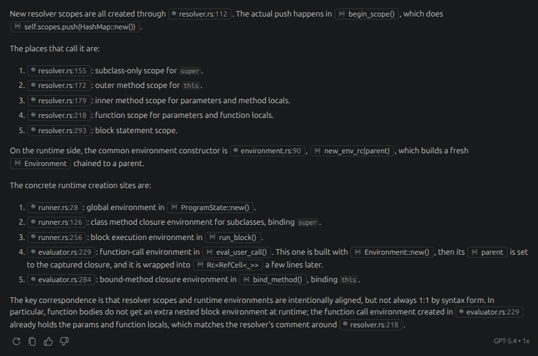

In my [previous post](), I shared some of my thoughts on
the CodeCrafters website and the coding challenges it offers. In particular, I had completed the
[HTTP server](https://app.codecrafters.io/courses/http-server/overview) challenge in Rust and
[Claude Code](https://app.codecrafters.io/courses/claude-code/overview) challenge beta (notably,
the number of available stages, and the feature set of the "completed" code, are quite limited)
in Python and was working on the
[Interpreter](https://app.codecrafters.io/courses/interpreter/overview) challenge in Rust. I have
since completed the Interpreter challenge, and decided to share some more thoughts on the
experience.

## A command-line LLM chatbot: going beyond the challenge requirements

I've added a prompt loop, some additional tools (including web search), and Markdown rendering of
responses (using the [rich](https://github.com/Textualize/rich) library) to the Claude Code
challenge beta, producing a more full-featured command-line LLM chatbot. The extended version is
posted [here](https://github.com/yinchi/openai_demo).

In the meantime, I've managed to procure a GB10 workstation, and decided to test the chatbot with
a local LLM server. After some experimentation, I settled upon using vLLM and the
`google/gemma-4-26B-A4B-it` model from Google. Logging output suggests a top speed of around 25
tokens per second, which is acceptable for a self-owned workstation that won't break the bank.
That being said, there's really not much point in my CLI tool beyond being a short educational
project, and I've installed [Open WebUI](https://github.com/open-webui/open-webui) as a more
user-friendly local interface for testing out the LLM instance.

I've also learned that different LLM servers implement different subsets of the OpenAI API. For
example, [**Ollama** states](https://docs.ollama.com/api/openai-compatibility#/v1/responses)
(emphasis mine):

> Ollama supports the
> [OpenAI Responses API](https://developers.openai.com/api/reference/resources/responses).
> **Only the non-stateful flavor is supported** (i.e., there is no `previous_response_id` or
> conversation support).

Meanwhile, there seems to be some support for the `previous_response_id` parameter in **vLLM**,
but the documentation is a bit sparse and I haven't had the chance to test it out yet.
Furthermore, the
[Chat Completions API](https://developers.openai.com/api/reference/chat-completions/overview)
appears to be more widely supported, and allows for more granular control over the conversation
history and tool calls, so I may end up sticking to that for the time being.

## Completing the Interpreter challenge

At a certain point in the challenge, I found myself implementing certain expression rules in
quite a repetitive manner: add the token type to the tokenizer, add a parsing rule to the parser,
and add an evaluation rule to the interpreter. Much of this code was in fact generated via
AI-assisted code completion, which was fine: I still understood what was going on.

However, the second half of the challenge was much more challenging, involving variable scopes,
functions, and classes with inheritance. I found myself relying more and more on AI, transitioning
from "AI-assisted code completion" to "AI-assisted design and implementation" via Copilot Chat. In
some ways, this is fine &mdash; many argue that the future (present?) of programming will go even
further, with most code written by AI **autonomously** and even less involvement from a human
programmer (me), as compared to my extensive interactions with Copilot Chat in this exercise.

At the same time, I feel like I may not understand the completed code as well as I should.
Specifically, when precisely does the
[resolver](https://craftinginterpreters.com/resolving-and-binding.html) create a new scope? What
is the relationship between scopes and
[environments](https://craftinginterpreters.com/statements-and-state.html#environments)? Perhaps
I could come up with an answer to these questions by reading the book (and the completed Rust
code) more carefully, but it's hard to really build a mental model of how these parts work as a
whole given their complexity. Copilot Chat's answer is actually not that long, but still requires
some effort to parse and understand:

Basically, I've retained the superficial understanding that scopes and environments are used to
manage variable bindings (e.g. allowing a variable `x` to refer to different values in different
parts of the program), but I don't have a deep understanding of how they were implemented in this
particular interpreter, and how they interact with each other. I hope what I've gotten out of
this challenge is enough, because other projects are calling for my attention now.

## Next challenge?

I'm thinking of trying out the
[Build your own `grep`](https://app.codecrafters.io/courses/grep/overview) challenge next, which
involves implementing a simplified version of the `grep` command-line tool. This challenge
interests me because there are many different algorithms to try out, each with their own use
cases:

- Plain string search (e.g. Knuth-Morris-Pratt algorithm or Rabin-Karp algorithm)
- A choice of fixed strings, e.g. `foo|bar|baz` (e.g. Aho-Corasick algorithm)
- NFA construction and simulation for regular expressions (e.g. Thompson's construction)
- Backtracking for regular expressions with backreferences

I'm also thinking of attempting a challenge (either the `grep` challenge or another one) in Go,
so I can add another language to my repertoire. The `grep` challenge seems like a good candidate
for this, because it doesn't require concurrency, which may be difficult to implement in a
language I'm not familiar with. I can always try out another challenge in Go later on if I want
to explore concurrency in the language.

As for the [Shell](https://app.codecrafters.io/courses/shell/overview) challenge I've partially
attempted before, I doubt I'll return to it anytime soon, as other than handling keyboard events
like `Tab` (for autocompletion), for which the recommended route is simply using a third-party
library such as [rustyline](https://github.com/kkawakam/rustyline), there seems to be much
overlap with the Interpreter challenge, only in a different language (shell script instead of
Lox) and with the extra complexity of handling incomplete input (again, due to the autocompletion
feature).

## The ultimate challenge: building something new (and useful)

The CodeCrafters challenges are fun and educational, but they all involve re-implementing
existing tools or apps. Eventually, I want to build something new and useful, rather than just
re-implementing something that already exists.

Although, to be honest, the end product will probably be a web app of some kind, just so I can
say on my résumé that I have experience with frontend frameworks, databases, containers, user
authentication, *kitchen sinks*, etc. But, no matter what I come up with, or how long it takes
before I finally get around to implementing it, I promise it won't be yet another kanban board or
habit tracker 😉.
