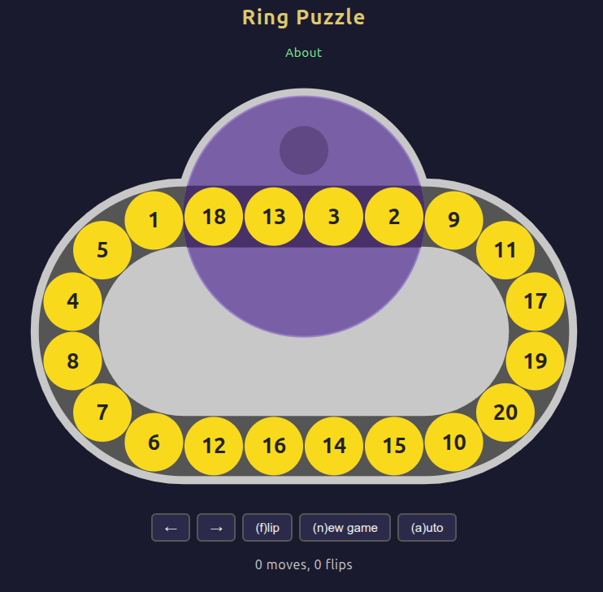

In a (much) earlier [post]() of mine, I discussed a puzzle called *Top
Spin* (once made by Binary Arts), in which 20 beads were placed on an oval track with a turntable
that could flip the four beads that occupy it. I showed that it was possible to reverse the order
of the beads, from `[1, 2, 3, ..., 19, 20]` to `[20, 19, ..., 2, 1]`, even if the beads were
placed on a straight track instead of an oval one.

However, recently I wanted to find create a more general solver that could correctly orient any
permutation of the beads, not just the reversed order. Obviously, relying on the circular nature
of the actual Top Spin puzzle would be required. Furthermore, while I doubt a perfect solver that
always solved each permutation of the puzzle would be achievable, I still wanted to make
something that was reasonably efficient.

## Greedy algorithm

A trick one can use is to realize that for a run of up to 16 consecutive beads, it is always
possible to prepend or append a target bead to that run. In the following, the dark beads are the
ones in the turntable and the goal is simply to place 12 next to 11. We use L/R to representing
shifting the entire chain of beads one space to the left/right, and F to flip the turntable 180
degrees:

```
Move 12 left 3 places

⑪⓭⓮⓯⓬ F
⑪⓬⓯⓮⓭ 11-12 done
```

```
Move 12 left 2 places

⑪⓭⓮⓬⓯⑯ L
⑪⑬⓮⓬⓯⓰ F
⑪⑬⓰⓯⓬⓮ R
⑪⓭⓰⓯⓬⑭ F
⑪⓬⓯⓰⓭⑭ 11-12 done
```

```
Move 12 left 1 place

⑪⓭⓬⓮⓯⑯ F
⑪⓯⓮⓬⓭⑯ apply left-2 shift
⑪⓬⓭⓰⓯⑭ 11-12 done (and also 13 in this specific case)
```

The moves to shift a bead 1 to 3 places to the right are similar but mirrored (flips stay the
same, L/R are interchanged).

Note that in the above left-shift examples, 11 doesn't move and the highest bead that ever gets
moved is 16. This shows that the greedy algorithm can always operate if there are at least 5 free
beads. For extra greediness, we always grow the end of the consecutive-bead run that requires
fewer moves to complete, even if it costs us more moves later due to the different number of
moves required for each shift amount.

## Bidirectional breadth-first search

To simplify the endgame, we shift map the numbers in the chain via a circular shift so that the
run of 16 sorted beads we created is always 1-16, then rotate the beads until 1-4 are in the
turntable. Bidirectional breadth-first search (BFS) was then used to find a solution for
detangling the last four beads for all 24 possible permutations (including the already solved
state ⑰⑱⑲⑳).

Finally, the set of greedy first-16 moves, endgame pre-rotation, and endgame solution are stitched
together. To possibly save a few redundant moves, a stack-based approach is used to cancel out
opposing moves: for example if the full solution is "FRFLLRRF", we can eliminate all nested
matching pairs to leave only the initial "FR", then discard the "R" as we consider all
orientations of a solved puzzle to be equally solved.

Not surprisingly, the bidirectional BFS uses quite a few GB of memory. I was able to bring the
memory usage down somewhat by changing from `list[int]` to `bytes` to store ring states, although
the inefficiency of implementing a tree data structure in Python probably had much to do with it
as well. Luckily, it's not a search one needs to do more than once, and the longest sequence was
"only" 44 moves for ⑱⑳⑰⑲.

## Time to play!

I've created [terminal-based](https://github.com/yinchi/ring_puzzle) and
[web-based](https://yinchi.github.io/ring_puzzle/) versions of the puzzle with the integrated
auto-solver.

Copilot Chat was used to turn much of the UI and auto-solver logic into code, with the web UI
being pretty much *entirely* "vibe-coded" (including porting the auto-solver logic from Python to
TypeScript). That being said, there were a lot of details to work out before the AI got the UI
right:

- The width of each straight's centerline is exactly the diameter of the turntable, or four bead
  diameters.
- Each semicircle section fits six beads, so that the the first and last beads are tangent to
  those in the straight.

Originally, I thought that the 1st and 6th beads here were **centered** at the corners between
the straight and semicircular sections, but it was actually their edges that are tangent to these
points. The AI helped design the current layout which seems to match the original better.

- When rotating the turntable, counter-rotate the four beads being manipulated to keep the
  numbers upright.

This I thought I was pretty clear about, but the first iteration of the UI still only flipped the
four beads horizontally instead of having them follow the rotating turntable.

- Always rotate the turntable in the same direction.
- After each move, **reset** all bead positions and rotations, and paint numbers onto the beads
  based on their new locations. Even the rotation of the turntable is reset, with the thumb
  indentation swapped to either the top or the bottom. This ensures that a single set of SVG
  animations can be used for each corresponding move (L/R/F), regardless of puzzle state (other
  than the thumb indentation swap).

In other words, the better you understand the task and can relay it to the AI, the better your
results will be. This is why I consider it to be mostly an accelerator: it helps good programmers
write good software faster, and bad programmers write **bad** software faster. I continue to try
to move closer to the first category.

## A weird Webkit issue

A family member of mine with an iPhone discovered that the web UI, that was working fine on our
desktop PCs and my Android Phone, was broken on his iPhone. Copilot suggested this was an issue
with how Webkit was handling my animations, which combined SVG and CSS manipulations. A
[pure CSS-manipulation approach](https://github.com/yinchi/ring_puzzle/commit/9e023faf1547909eda31b63fa11a3b874831c74d)
appeared to solve the issue.
