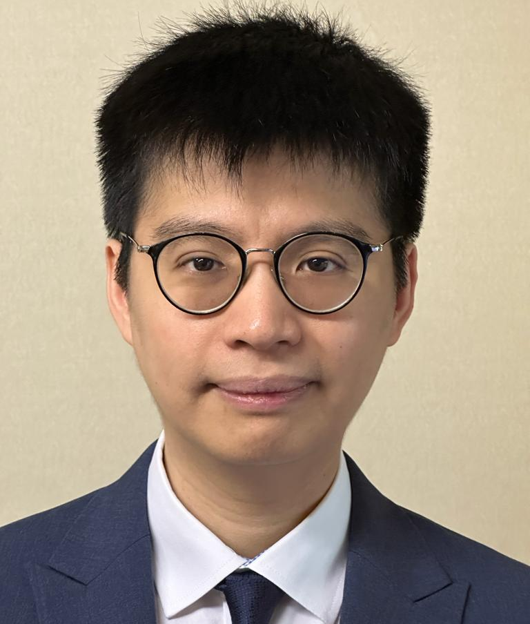

# Yin-Chi Chan, PhD

<table>
    <tr>
        <td>
            
        </td>
        <td>
            <ul>
                
<b>Name:</b> Yin-Chi Chan

                <ul>
                    <li><b>Chinese:</b> 陳衍智</li>
                    <li><b>Jyutping:</b> can4 hin2 zi3</li>
                    <li><b>IPA:</b> tsʰɐn˨˩ hi:n˧˥ tsi:˧</li>
                </ul>
                
<b>Email:</b> y.c.hk(at)ieee(dot)org

            </ul>
        </td>
    </tr>
</table>

I am a research associate at the [Institute for Manufacturing](https://www.ifm.eng.cam.ac.uk/), the University of Cambridge. My research interests include simulation modelling of stochastic systems, e.g. in healthcare service delivery.

## Bio

I was born in Hong Kong and moved to Canada for several years as a child, returning to Canada to study at the University of Waterloo. I then completed my Masters and PhD at the City University of Hong Kong. In Dec 2021, I moved to the UK to work as a research associate at the University of Cambridge. 🇭🇰 🇨🇦 🇬🇧

My Erdős number is 3: Erdős → Charles K. Chui → [Guanrong Chen](https://www.ee.cityu.edu.hk/~gchen/erdos.html) → me (thanks to [this paper](https://doi.org/10.1109/ACCESS.2020.3032584))

## Links

- [Google Scholar Profile](https://scholar.google.com/citations?user=NJEB3swAAAAJ)
- [ORCID profile](https://orcid.org/0000-0002-2405-8472)
